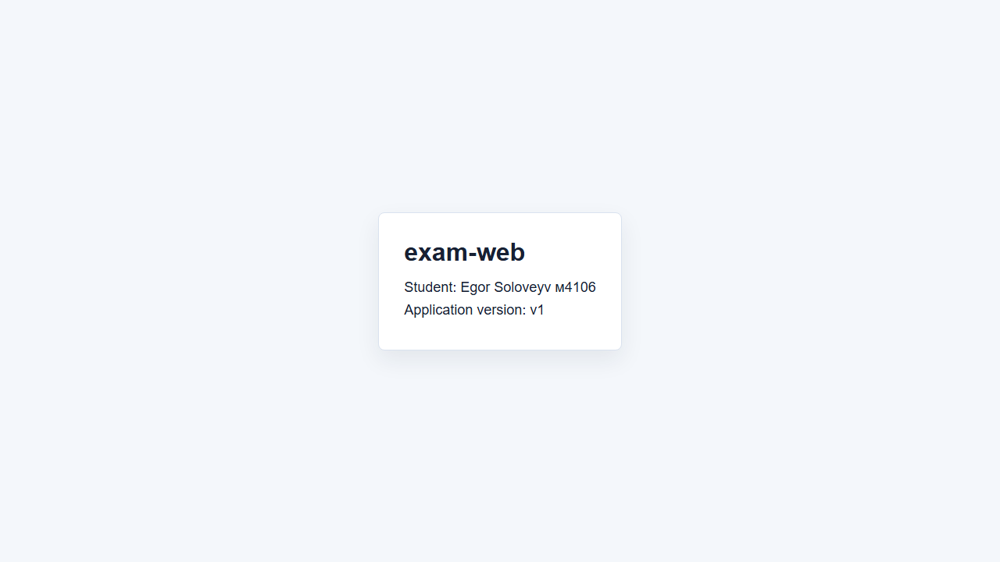

# exam-web

Simple Kubernetes web application for the exam task. The app uses `nginx:1.27-alpine`, runs in the `exam-k8s` namespace, and serves `index.html` from a Kubernetes `ConfigMap`.

## Objects

- `Namespace`: `exam-k8s`
- `ConfigMap`: `exam-web-config`
- `Deployment`: `exam-web`, 2 replicas
- `Service`: `exam-web-service`, `ClusterIP`, service port `8080`, target port `80`

## Apply

```bash
kubectl apply -f k8s/
```

## Check

```bash
kubectl get all -n exam-k8s
kubectl -n exam-k8s port-forward service/exam-web-service 8080:8080
curl http://localhost:8080
```

The response must contain the `exam-web` HTML page from the `ConfigMap` with student information and application version `v1`.

## Screenshot


